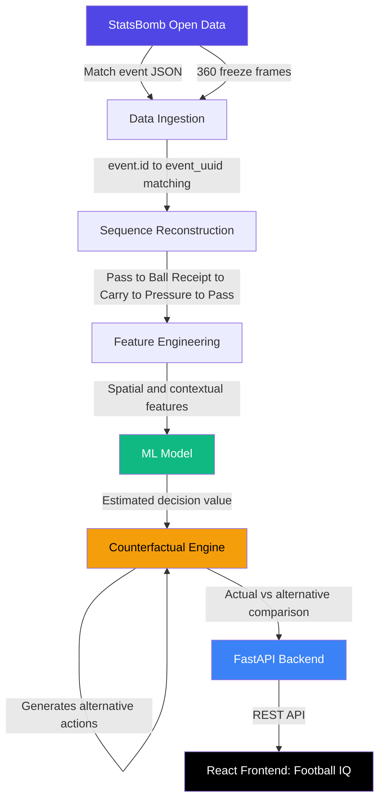
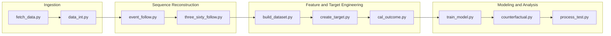

# Counterfactual Football Intelligence

A football analytics system that uses StatsBomb Open Data and machine learning to evaluate player decisions in event context and compare them against plausible alternative actions.

---

## Overview

In modern football, players constantly make decisions under changing spatial and tactical conditions — whether to pass, carry the ball, or take a shot. Conventional football analytics largely describes *what happened*, rather than evaluating the *quality of the decision* made in the specific context in which it occurred.

This project builds a data-driven system that:

- Reconstructs sequences of player actions from match event data
- Incorporates 360-degree spatial context — teammate and opponent positions, pressure, and player location
- Estimates the outcome or value of a decision given the game state
- Generates plausible **counterfactual alternative actions** for a given moment and compares their estimated values against the action actually taken

The goal is to move beyond basic statistical analysis by combining football event analytics, spatial data, machine learning, and counterfactual reasoning to provide an explainable assessment of player decision-making.

---

## System Architecture



---

## Data Pipeline



| Script | Purpose |
|---|---|
| `fetch_data.py` | Retrieves StatsBomb event and 360 freeze-frame data |
| `data_int.py` | Data integrity checks and initial integration |
| `event_follow.py` | Reconstructs possession/action sequences from event data |
| `three_sixty_follow.py` | Matches events to 360 freeze frames via `event.id` / `event_uuid` |
| `build_dataset.py` | Builds the analytics-ready feature dataset |
| `create_target.py` | Defines the ML prediction target |
| `cal_outcome.py` | Calculates decision/action outcome values |
| `train_model.py` | Trains the outcome-value estimation model |
| `counterfactual.py` | Generates and evaluates counterfactual alternative actions |
| `process_test.py` | Testing and validation of the processing pipeline |

---

## Methodology

1. **Data Ingestion** — Match event data and 360-degree freeze frames are pulled from StatsBomb Open Data. Current exploration is centered on the 2022 FIFA World Cup (64 matches with 360 data available).
2. **Sequence Reconstruction** — Related events (e.g. Pass, Ball Receipt, Carry, Pressure, Pass) are linked into possession/action sequences, with each event matched to its corresponding 360 freeze frame.
3. **Feature Engineering** — Spatial and contextual features are extracted: player positions, teammate/opponent positions, pressure, action type, pass characteristics, and outcomes.
4. **Outcome Modeling** — A machine learning model estimates the value of a decision given the reconstructed game state.
5. **Counterfactual Analysis** — Plausible alternative actions are generated for the same game state, with their estimated values compared against the action actually taken — surfacing situations where a different choice may have produced a more favorable outcome.
6. **Visualization** — Results are served through a FastAPI backend and visualized in the React frontend, **Football IQ**.

---

## Frontend: Football IQ

The frontend is a decoupled React application that visualizes match events, 360 spatial context, player decisions, estimated decision values, and actual-vs-alternative comparisons.

**Sections:**
- Dashboard
- Matches
- Decision Analysis
- Player Analysis
- Heatmaps
- Reports
- About

The UI supports both light and dark modes, with alternative/counterfactual decision outputs designed to be shown as an animated simulation of player and ball movement rather than static 2D map snapshots.

---

## Tech Stack

| Layer | Technologies |
|---|---|
| Data Source | StatsBomb Open Data (event + 360 data) |
| Data Processing | Python, Pandas |
| Machine Learning | Python (model training and counterfactual generation) |
| Backend | FastAPI |
| Frontend | React |

---

## Project Structure

```
counterfactual_football_intelligence/
│
├── frontend/
│   └── (React application — Football IQ)
│
├── models/
│   └── (trained model artifacts)
│
├── fetch_data.py
├── data_int.py
├── event_follow.py
├── three_sixty_follow.py
├── build_dataset.py
├── create_target.py
├── cal_outcome.py
├── train_model.py
├── counterfactual.py
├── process_test.py
├── LICENSE
└── README.md
```

---

## Project Status

This project is in active development. Data ingestion and sequence reconstruction have been validated — StatsBomb event IDs correctly link to their 360 freeze frames, and related events can be reconstructed into coherent action sequences. The ML target, feature set, and counterfactual methodology are still being finalized.

---

## Local Setup

### Clone the Repository
```bash
git clone https://github.com/Harshan07-web/counterfactual_football_intelligence.git
cd counterfactual_football_intelligence
```

### Data Pipeline
```bash
python fetch_data.py
python data_int.py
python event_follow.py
python three_sixty_follow.py
python build_dataset.py
python create_target.py
python cal_outcome.py
```

### Model Training and Counterfactual Analysis
```bash
python train_model.py
python counterfactual.py
```

### Frontend
```bash
cd frontend
npm install
npm run dev
```

---

## Future Improvements

- Finalize ML target definition and feature set
- Expand dataset coverage beyond the 2022 FIFA World Cup
- Integrate the counterfactual engine with the FastAPI backend
- Animated simulation view for counterfactual outputs in the frontend
- Model evaluation and explainability reporting

---

## License

This project is licensed under the MIT License.

---

## Author

**Harshan**
GitHub: [@Harshan07-web](https://github.com/Harshan07-web)
